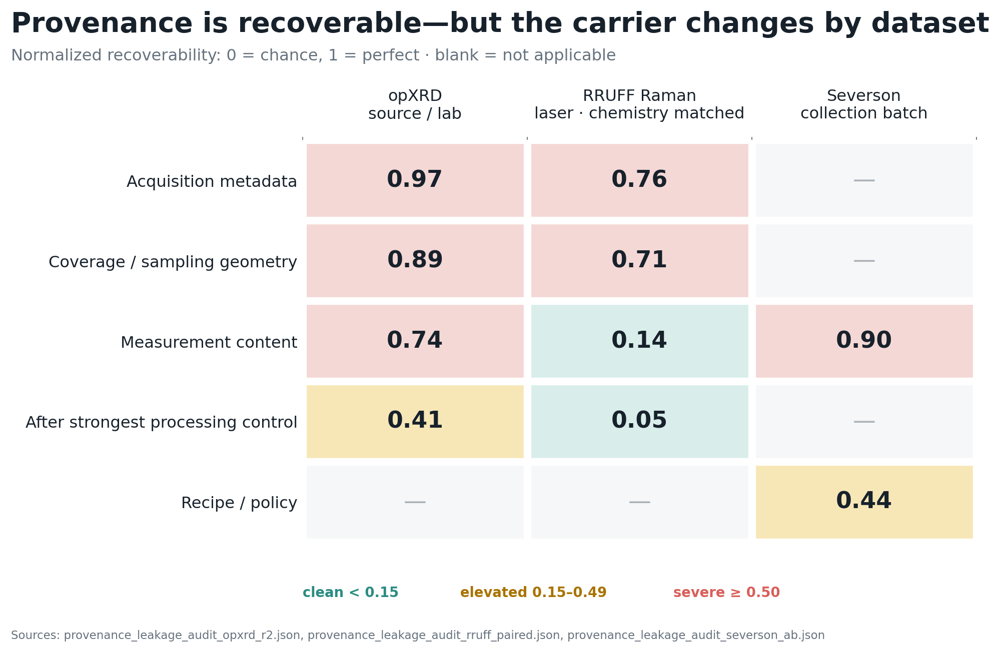

# Figure Guide

## Where provenance lives



### The question

Can a simple model identify where a measurement came from using information stored in
the record?

Here, “provenance” means:

- the source laboratory or contributor for opXRD;
- the Raman laser wavelength for RRUFF;
- the collection batch for the Severson batteries.

If provenance is recoverable, a downstream model could potentially learn collection
style instead of—or in addition to—the materials signal of interest. Recoverability is
therefore a warning that provenance-controlled evaluation is needed. It is not, by
itself, proof that a downstream model actually used the shortcut.

### Why can provenance become predictable?

The measured record is not produced by the material alone. A more realistic description
is:

```text
observed record
    = material response
    + instrument and acquisition settings
    + sample preparation
    + preprocessing and export choices
    + dataset selection
```

Provenance can affect every term except the material response—and it can correlate with
the material response through dataset selection. The model only sees the resulting
numbers. Unless the evaluation design separates these causes, it has no way to know which
variation researchers intended it to use.

There are four main mechanisms in these datasets.

#### 1. Different sources measure different materials

If one laboratory mostly contributes one chemistry family and another contributes a
different family, chemistry predicts laboratory and laboratory predicts chemistry. A
model can use a real materials signal while simultaneously appearing to recover
provenance.

This was the important RRUFF result. Raman-content recoverability fell to clean once the
same mineral specimens were compared across laser wavelengths. The earlier spectral
association was therefore largely a composition-selection effect, not an isolated laser
fingerprint.

#### 2. Acquisition settings directly alter the numerical representation

Point count, angular or spectral range, step size, detector resolution, exposure, and
missing regions can make two records visibly different before their scientific content
is considered.

These signals are often attractive to a model because they are:

- repeated consistently across many records from one source;
- relatively low-noise;
- spread across the whole record rather than confined to a subtle peak or transition;
- easy for even a linear classifier to detect.

For example, opXRD point count alone has recoverability `0.73`. In chemistry-matched
RRUFF, point count alone scores `0.53`, and metadata with all range fields removed still
scores `0.59`. The signal is not merely a sophisticated neural model choosing an odd
feature; simple probes can recover it.

#### 3. Preprocessing leaves a source-specific software fingerprint

Background subtraction, normalization, smoothing, interpolation, grid conversion, and
file export can differ between laboratories. The datasets called “raw” in this project
have generally already passed through some of those steps. A model may therefore identify
the laboratory's processing pipeline rather than its instrument.

#### 4. The relationship of interest can itself change by batch

In Severson, “batch” bundles collection date, cell-manufacturing lot, calendar aging,
protocol refinement, and possibly equipment state. Charging policies are also nested
inside batches. Consequently, the mapping from early trajectory to lifetime need not be
identical across batches.

The held-out-batch ranking experiment supports this mechanism: ridge ranks batch-3
siblings at `0.779` when trained on other policies including batch 3, but only `0.522`
when trained on batches 1 and 2. Batch identity does not directly separate the siblings
because both belong to the same batch. Instead, the learned trajectory-to-lifetime rule
is batch-local.

### Is this “the model paying attention to the strongest property”?

Sometimes, but that wording needs care.

Training does not know which variables are scientifically legitimate. It assigns weight
to any stable pattern that reduces prediction error. A provenance feature can dominate
when it is easier, cleaner, or more repeated than the desired materials signal. It can
also supplement a real materials signal rather than replace it.

Most importantly, **recoverable does not mean used**. The provenance probe only shows
that the information is available. In the opXRD analysis, per-source spectral
recoverability had essentially zero correlation (`Spearman = 0.03`, with only six
sources) with held-out-source transfer failure. Source size was more associated with
transfer difficulty (`Spearman = -0.71`). So a strong provenance fingerprint does not
automatically tell us whether a downstream model relied on it.

### How to read the figure

Read down each column to see which part of a record carries provenance for that dataset.
Read across a row to see whether the same kind of information behaves similarly across
datasets.

Each number is a provenance-recoverability score normalized relative to chance:

```text
(balanced accuracy - chance) / (1 - chance)
```

- `0.00` means the probe performed at chance.
- `1.00` means provenance was recovered perfectly.
- Green (`< 0.15`) is treated as clean.
- Yellow (`0.15–0.49`) is elevated.
- Red (`>= 0.50`) is severe.
- A dash means that feature family was not available or was not a meaningful equivalent
  in that dataset.

The colors are diagnostic risk bands, not statistical significance categories.

### Initial hypotheses

The work began with a plausible but overly simple expectation:

> Provenance should be recoverable from raw measurement content, and aggressive
> preprocessing should reduce the signal without fully removing it.

The preregistered dataset-specific predictions sharpened that expectation:

1. **opXRD:** source identity would remain severely recoverable from raw XRD spectra
   after honest in-fold dimensionality reduction. Acquisition metadata and coverage
   were also expected to remain severe. The strongest spectral processing control was
   expected to reduce—but not eliminate—the signal.
2. **RRUFF:** laser wavelength would remain recoverable from Raman spectral content
   after holding mineral chemistry constant. The expected chemistry-matched spectral
   score was at least `0.30`. Cropping and derivatives were expected to reduce the
   signal without neutralizing it.
3. **Severson:** collection batch would be severely recoverable from the first 100
   cycles of trajectory features, showing that provenance recovery is not specific to
   diffraction or spectroscopy.

### What ablations have already been tried?

The repository has done more than a single provenance-classification probe:

| Ablation or control | Dataset | What it established |
| --- | --- | --- |
| Fit PCA only inside each training fold | opXRD | High recoverability was not caused by test rows shaping the representation. |
| Remove the near-tautological `is_labeled` curation field | opXRD | Metadata remained severe (`0.977 -> 0.972`). |
| Audit metadata fields one at a time | opXRD | Point count and coverage fields are major carriers; no one field explains the full fingerprint. |
| Crop to common range, row-normalize, and differentiate | opXRD and RRUFF | Processing reduced opXRD provenance but did not remove it; it neutralized RRUFF spectral-content recovery. |
| Chemistry-match the same specimens across provenance classes | RRUFF | Spectral recovery was mainly composition-loaded; acquisition geometry survived. |
| Remove all range fields and test point count alone | RRUFF | Geometry recovery was not merely a wavelength-range tautology. |
| Compare recipe, trajectory summaries, and raw discharge curves | Severson | Batch is present in both experimental policy and measured trajectory, and is strongest in trajectory. |
| Hold out an entire collection batch for downstream prediction | Severson | Lifetime-level prediction transfers linearly, but within-recipe ranking does not. |
| Leave one source out and compare against interpolation | opXRD | Provenance availability and downstream transfer difficulty are distinct axes. |
| Source-balanced sampling | opXRD | Naive rebalancing did not repair held-out-source transfer. |
| Provenance-only baselines, residualized targets, and within-provenance shuffles | Synthetic event pilot | The analysis framework can distinguish row-level event signal from provenance-group shortcuts, but this is not yet real-data evidence. |

### Which deeper ablations are still needed?

The most useful next tests form a causal ladder.

1. **Feature-family ablation on Severson.** Audit QDischarge, resistance, temperature,
   charge time, roughness, and policy separately; then leave each family out. This would
   localize which trajectory measurements carry batch.
2. **Fold-local provenance removal.** Learn a batch-predictive subspace using training
   data only, remove or adversarially suppress it, and rerun lifetime prediction and
   sibling ranking. If ranking disappears, the same components carry both batch and the
   apparent task signal. If ranking survives, useful information remains beyond the
   easily decoded fingerprint.
3. **Matched downstream evaluation.** Compare samples matched on chemistry, recipe, or
   other intended variables while provenance changes. RRUFF supports this because some
   specimens were measured at multiple wavelengths. opXRD and Severson largely do not.
4. **Crossed acquisition experiment.** Measure the same physical samples across
   instruments, sessions, operators, preparation routes, and acquisition settings. This
   is the clean way to separate material from collection effects.
5. **Counterbalanced making events.** Distribute replicates of each recipe across batch,
   session, operator, lot, and run order. Then materials variables and provenance are no
   longer statistically inseparable by design.

Feature importance or SHAP can help prioritize fields, but it cannot solve confounding:
when chemistry and source always move together, attribution can describe the predictor
without identifying the cause.

### Why have the remaining tests not already been run?

The limiting issue is mostly the data design, not the absence of statistical methods.

- opXRD sources measured different material mixtures, so it lacks the crossed
  source-by-chemistry structure needed for causal separation.
- Severson has only three batches, policies are nested within batches, and 136 of 160
  ranking pairs come from one batch.
- Public “raw” records do not expose every instrument, processing, lot, and preparation
  variable needed for residualization.
- Batch-removal methods such as residualization, domain-adversarial training, or batch
  correction can also erase genuine materials information when provenance is confounded
  with chemistry. Applying them without a crossed design can produce a cleaner-looking
  representation without proving it is more scientifically faithful.

The repo therefore uses public data to detect and localize the risk, then treats
controlled collection as the resolution path. A same-sample XRD round-robin and a
provenance-counterbalanced material-making pilot are already proposed, but they require
new measurements. Continuing to tune correction methods on the same observational public
datasets would not fix the underlying identifiability problem.

### What the results say

#### opXRD: provenance is distributed across the whole acquisition record

- Acquisition metadata: `0.97`, severe.
- Coverage and sampling geometry: `0.89`, severe.
- XRD measurement content: `0.74`, severe.
- After the strongest processing control: `0.41`, still elevated.

This validates the opXRD predictions. Source identity is not carried by one trivial
curation field: it is distributed across acquisition metadata, angular coverage, and
the measured spectrum. Aggressive spectral processing removes about 45% of the
recoverability but does not make the dataset provenance-clean.

Interpretation:

> On opXRD, normalization alone cannot be assumed to remove the source/laboratory
> fingerprint.

#### RRUFF: the chemistry-matched control changes the mechanism

- Acquisition metadata: `0.76`, severe.
- Coverage and sampling geometry: `0.71`, severe.
- Raman measurement content: `0.14`, clean.
- After the strongest processing control: `0.05`, clean.

This falsifies the original RRUFF spectral-content prediction. The preregistered
chemistry-matched expectation was at least `0.30`; the measured value was `0.14`.
Once the same specimens are compared across laser wavelengths, the Raman fingerprint
itself no longer identifies the laser above the risk threshold.

At the same time, metadata and coverage remain severe. The surviving
composition-independent signal is therefore acquisition geometry—especially point
count and spectral coverage—not Raman content.

Interpretation:

> In RRUFF, an apparent raw-spectrum provenance signal was mostly associated with which
> minerals were measured. The robust instrument fingerprint lives in how measurements
> were acquired and stored.

This is an informative invalidation: provenance remains a real concern, but the
originally proposed carrier was wrong.

#### Severson: the experimental trajectory itself carries batch

- Early event trajectory: `0.90`, severe.
- Recipe or charging policy: `0.44`, elevated.

This validates the preregistered modality-generality hypothesis. Batch is strongly
recoverable from battery trajectories, so the provenance problem is not peculiar to
XRD or Raman archives. Recipe also carries batch because charging policies are nested
within collection batches, but trajectory features are substantially more identifying.

Interpretation:

> A rich event representation is not automatically provenance-neutral. It can preserve
> collection style along with useful physical information.

### Which expectations survived?

| Prediction | Outcome | Verdict |
| --- | --- | --- |
| opXRD raw spectra retain source identity | `0.74`, severe | Validated |
| opXRD metadata and coverage remain strong | `0.97` / `0.89`, severe | Validated |
| opXRD processing reduces but does not remove provenance | `0.74 -> 0.41` | Validated |
| Chemistry-matched RRUFF spectral content identifies laser at `>= 0.30` | `0.14`, clean | Falsified |
| RRUFF processing reduces but does not neutralize spectral provenance | `0.05`, clean | Falsified |
| RRUFF acquisition geometry survives chemistry matching | `0.76` / `0.71`, severe | Validated and sharpened |
| Severson trajectory identifies collection batch | `0.90`, severe | Validated |

### Main takeaway

The figure does **not** support the simple claim that raw measurements always encode
provenance in the same way. It supports a more useful conclusion:

> Provenance can be strongly recoverable, but its carrier is dataset-specific. In
> spectral archives it may live primarily in acquisition geometry; in event data it may
> live in the trajectory itself.

That means provenance audits must inspect metadata, coverage, raw content, and process
trajectories separately. A single normalization step or a single provenance probe is not
enough.

### What not to claim

Do not read a severe score as proof that a downstream materials result is invalid.
Recoverability only establishes that a shortcut is available. Whether a model actually
uses it must be tested with provenance-only baselines, provenance-blocked splits,
residualization, matching, or held-out-source/batch evaluation.

Also, the exact scores should not be treated as universal effect sizes. The columns use
different datasets, provenance labels, and numbers of independent provenance units.
The normalized score makes the diagnostic scale comparable, but it does not turn the
three studies into one controlled experiment.

### Evidence sources

- [opXRD preregistration and results](../../provenance-critique/provenance_leakage_audit.md)
- [RRUFF chemistry-matched and Severson preregistration and results](../../provenance-critique/second_dataset_replication.md)
- [Underlying opXRD manifest](../../../data/manifests/provenance_leakage_audit_opxrd_r2.json)
- [Underlying RRUFF paired manifest](../../../data/manifests/provenance_leakage_audit_rruff_paired.json)
- [Underlying Severson manifest](../../../data/manifests/provenance_leakage_audit_severson_ab.json)
