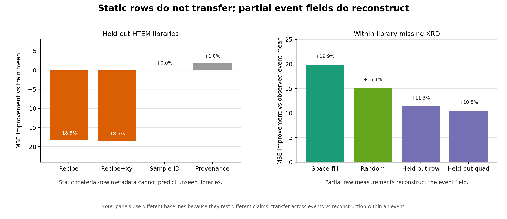
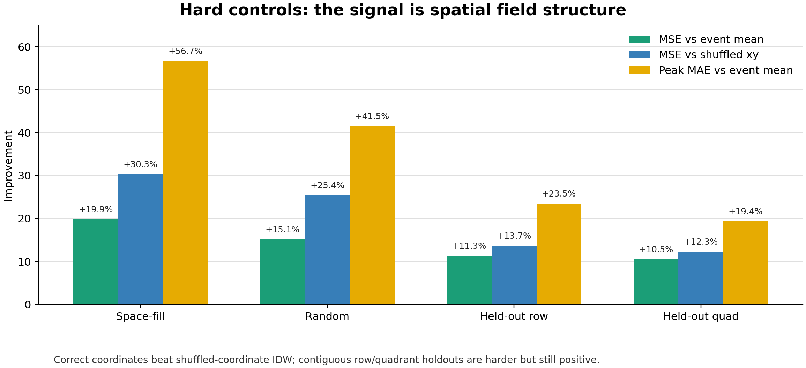
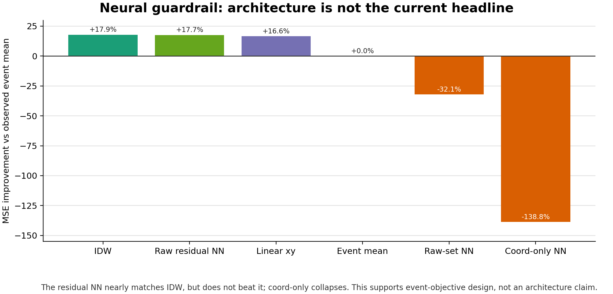

# Outreach Visuals

These figures are designed for short expert outreach, not as full paper figures.

## Main Contrast



Use this when the goal is to explain the project in one glance:

```text
static material-row metadata does not transfer across held-out libraries, while partial
raw measurements inside one experimental field reconstruct missing measurements.
```

Important caveat: the two panels use different baselines because they test different
claims: transfer across events versus reconstruction within an event.

## Hard Controls



Use this to demystify the result:

```text
correct coordinates beat shuffled-coordinate IDW, and contiguous holdouts are harder but
still positive.
```

This is the best evidence that the HTEM result is a real event-field signal, while still
being honest that it is spatial-field evidence rather than universal event-embedding
evidence.

## Neural Guardrail



Use this only if someone asks whether the neural model is the headline.

The answer is no. The residual neural model nearly matches IDW, but does not beat it.
That supports the event-native objective, not an architecture claim.

## Regenerate

```bash
.venv/bin/python scripts/plot_outreach_figures.py
```
